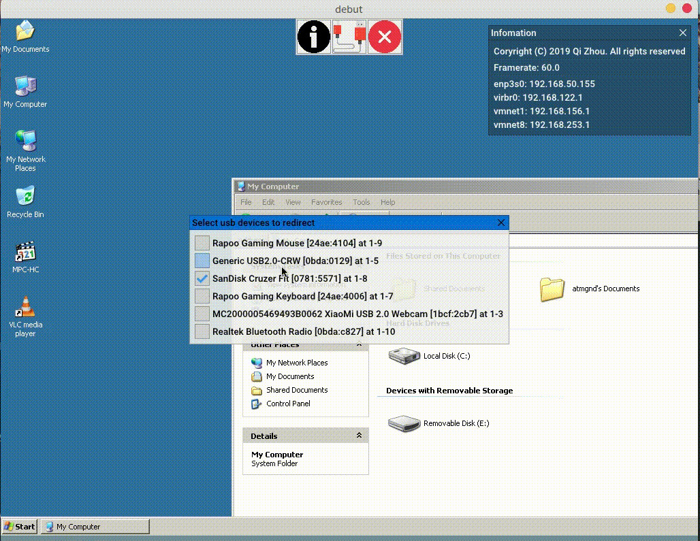

## debut
A remote desktop viewer or a simple spice client demo in c++, this software is just a **demostration** of spice-client-glib.

video: [https://v.youku.com/v_show/id_XNDUzNjAxNDY2MA](https://v.youku.com/v_show/id_XNDUzNjAxNDY2MA)

## lastest screenshot

## Usage
double click the target binary(== debut.exe or debut android app icon).

Hotkeys: F4(Exit) F5(popup usb redirect dialog)

## Prebuild binary
Windows and android: https://share.weiyun.com/5sskOC7

linux ISO(使用rufus记录U盘或光盘,或使用虚拟机网卡为e1000, 不支持音频, 不支持USB):
- 20191222: https://share.weiyun.com/5xITTHc
- 20200112: https://share.weiyun.com/5QCykDN - added setup program
- 20200118: https://share.weiyun.com/5yp7B0P - 完善了基本功能, 修正了一些错误

## screenshot
Windows

Android(x86 emulated)

Linux ISO: 

## License
This library is free software; you can redistribute it and/or modify it under
the terms of the GPL2 license. See [LICENSE](LICENSE) for details.
