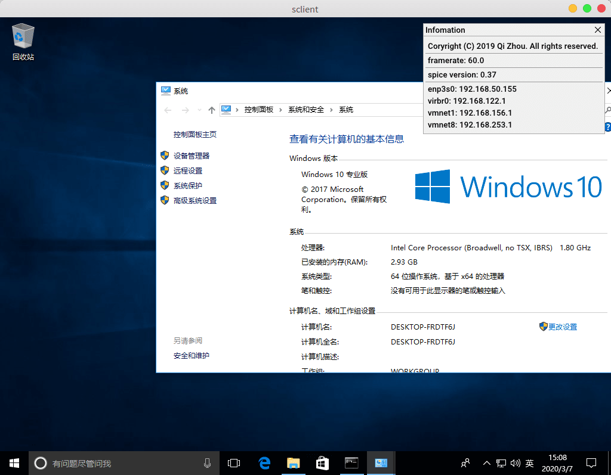
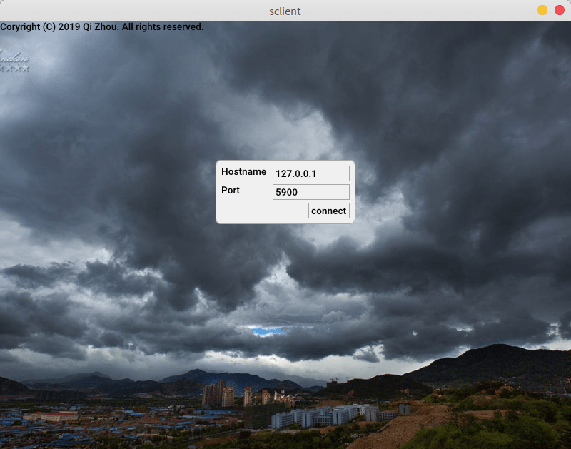
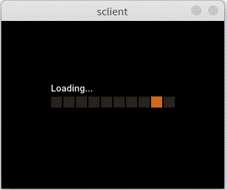
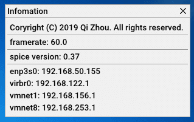
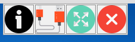
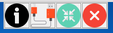
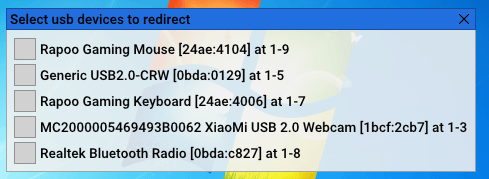
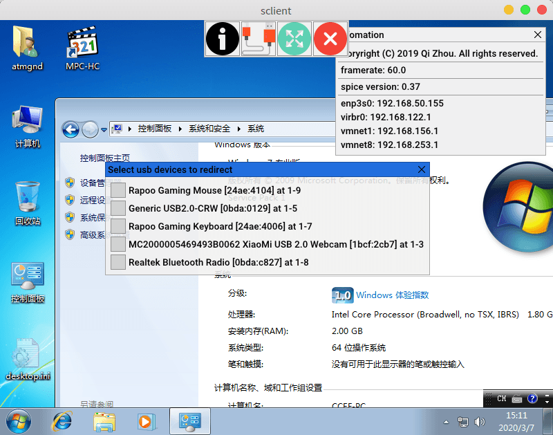

## sclient
一个测试用的spice远程桌面C++客户端. 目的仅为spice测试. 其可以作为单独的普通应用程序运行, 也可以以瘦终端模式运行(禁用了窗口化按钮与窗口大小调整, 没有标题栏).

支持系统: Windows/Android/Linux. Mac/ios(? 理论上支持, 没有相关设备, 未验证)

A remote desktop viewer or a simple spice client demo in c++, this software is just a **demostration** of spice-client-glib. But it is capable for daily use(with some modification). It can run as a standalone application and kiosk mode(resize disabled, no title bar). a kiosk system can be less than 100MB, consume only 200 MB memory(tested).

Support platform: windows/Android(?)/Linux. Mac/IOS(? theoretically supported, not verified, I don't own a imac)

演示视频/video: [https://v.youku.com/v_show/id_XNDUzNjAxNDY2MA](https://v.youku.com/v_show/id_XNDUzNjAxNDY2MA)

> 所有的截屏为ubuntu 18.04 lts下截取.
>
> The host operate system of all screenshots is ubuntu 18.04 lts.

## 下载/download

[下载 Download](https://github.com/atmgnd/debut/releases)

## 预览/Preview

## 连接页面/connect to

> 连接页面仅原型, 目前还没有为其定制的KVM平台. 如果有简单的KVM平台, 可能会重新设计此页面以加入连接认证.

## 加载动画/loading animation

## 信息面板/information panel

## 工具面板/toolbar

窗口模式/window mode

全屏模式/fullscreen

瘦终端模式/kiosk

> 瘦终端模式运行时没有全屏按钮与标题栏. (fullscreen buitton disabled when kiosk mode enabled)

## usb重定向/usb redirection

## 全部面板/all panels

## 许可/License
sclient 是免费软件.

sclient is free software.